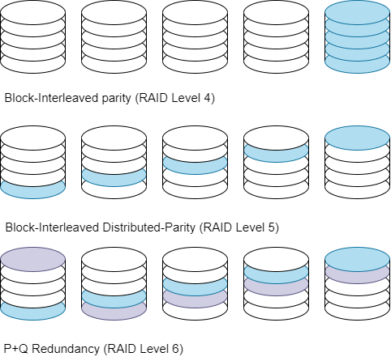

# CE7490 Project RAID6

CE7490 2022 Fall - Advanced Topics in Distributed System - Project 2: RAID-6 based distributed storage system

## Introduction
[RAID](https://en.wikipedia.org/wiki/RAID) (Redundant Array of Independent Disks) is developed for the demand of rising the reliability, capacity and speed of storage systems. The level of RAID6 is an extension of RAID5 by adding another parity block, which is designed to tolerate any two concurrent disk failure and maintain a relatively high storage efficiency. An example of RAID6 storage with double parity is shown below:

<p align="center">
    
</p>

## Installation Guide
The RAID-6 system is devloped in Python 3.9 environment with dependencies math, numpy, os and time library.

The project is supported on Linux and Windows using terminal / command line.


## Running Experiments

The standard way to run the test from terminal / command line is:

```
python test.py 
```

The test data file is stored in ```./data``` directory. 4 example files are provided, and you are free to add new file in this directory, only have to change the variable ```test_boj``` in the ```test.py```

## Reference
An excellent tutorial of implementing RAID6 using Reed-Solomon coding can be found at http://www.cs.utk.edu/~plank/plank/papers/CS-96-332.html
